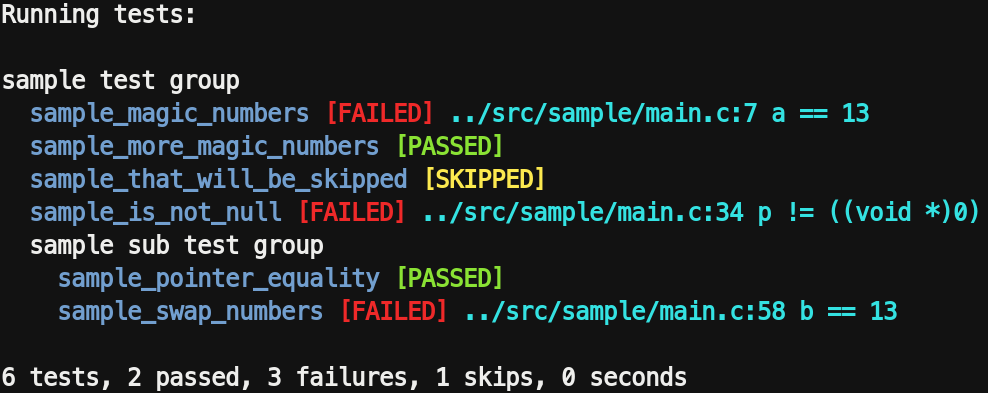

Testa
=====
A portable single file "test framework" for C/C++.

Getting Started
---------------
Take a look at `src/sample/main.c` for a quick and dirty test sample.

Contribute
----------
* Fork the project.
* Make your feature addition or bug fix.
* Do **not** bump the version number.
* Send me a pull request. Bonus points for topic branches.

License
-------
Copyright (c) 2017, Mihail Szabolcs

Testa is provided **as-is** under the **MIT** license.
For more information see LICENSE.
